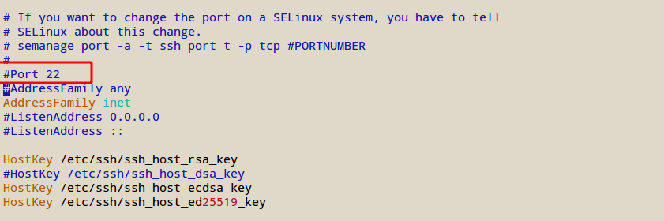
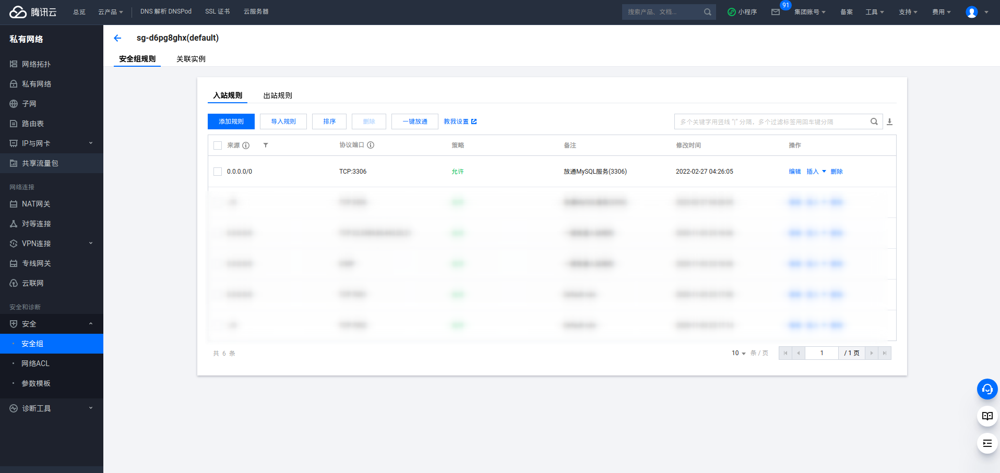

# 部署相关

## ssh连接服务器
假设有一台要登录的远程服务器，ip是134.175.170.11  

### 使用密码登录服务器
```bash
ssh root@134.175.170.11 #使用密码登录root帐号，服务器地址为134.175.170.11
ssh root@134.175.170.11 -p 2022 #上面是默认的登录端口22, 假如是特殊端口可以加-p命令，这里登录的是2022端口
```

可以修改默认的登录端口号，比较安全。有一些黑客会通过工具扫描服务器的端口，默认端口容易被扫描和攻击  
```bash
#修改登录端口号
vim /etc/ssh/sshd_config
```


修改登录的帐号密码,要输入两遍确认密码，这个密码不能太简单，不然黑客攻击当“肉鸡“  
```linux
#设置runoob用户的密码
passwd runoob
```

### 使用密钥登录服务器
我们分几个步骤  
1. 创建密钥  
2. 把密钥的公钥放到服务器  
3. 在电脑配置ssh登录的信息  

1.创建密钥  
```bash
#-t rsa是使用rsa加密，C参数是添加备注说明
ssh-keygen -t rsa -C "公司电脑"
```
创建密钥时，可以修改密钥文件的名称，默认是id_rsa，基本不需要修改，用默认就可以。    
同时也要输入两次密钥的密码（不需要密码直接回车），当你用这个密钥登录其他服务器或者使用这个密钥做其他用途时一般就会需要填写这个密钥密码来验证你的身份。  

```bash
#成功后，可以查看当前用户目录下的已经创建好id_rsa和id_rsa.pub了
ll ～/.ssh
总用量 52K
-rw-r--r-- 1 root root 2.4K  2月 21 01:39 config
-rw------- 1 root root 2.6K  6月 23  2020 id_rsa
-rw-r--r-- 1 root root  563  6月 23  2020 id_rsa.pub
```

2.在服务器配置登录的密钥公钥  
把公钥id_rsa.pub的内容复制到远程服务器下的/root/.ssh/authorized_keys文件里。   
假如远程服务器还没有/root/.ssh/authorized_keys文件  
```bash
touch /root/.ssh/authorized_keys    #创建文件
chmod 600 /root/.ssh/authorized_keys #修改文件权限为root用户可读写
``` 
配置登录的密钥公钥方法  
方法一:  
```bash
cat ~/.ssh/id_rsa.pub #查看公钥内容
#复制公钥内容，然后到远程服务器编辑保存
vim /root/.ssh/authorized_keys
```
方法二:
```bash
#使用scp命令,可以复制当前电脑的文件上传到远程服务器
scp ~/.ssh/id_rsa.pub root@134.175.170.11:/root/.ssh/authorized_keys
```

方法三:
```bash
#复制id_rsa公钥到远程服务器
ssh-copy-id -i ~/.ssh/id_rsa.pub root@134.175.170.11
```

3.配置ssh登录的信息  
在自己电脑配置ssh信息  
```bash
vim ~/.ssh/config
```
文件信息如下:  
```bash
Host test
    HostName 134.175.170.11 #登录ip
    Port 22 #端口号
    User root #登录用户
    IdentityFile ~/.ssh/id_rsa #登录的密钥
    ServerAliveInterval 60 #保持长连接，60秒访问一次
    ServerAliveCountMax 3   #断开重来三次
```
配置完这三个步骤，就可以直接`ssh test`进行登录了

## linux安装管理介绍

linux系统有很多发行版本，公司和商业常用的是centos和ubantu系统.  
- centos是基于rpm包管理系统，常用yum工具进行安装软件。    
- ubantu是基于deb包管理系统，常用apt-get管理工具。  

### yum工具使用介绍

#### yum命令
**用法：**  
yum [options] command [package ...]

**options:**  
```
-e [error level], --errorlevel=[error level] 错误输出级别  
-q, --quiet 安静的操作
-t 忽略错误
-R[分钟] 设置等待时间
-y 自动应答yes
--skip-broken 忽略依赖问题
--nogpgcheck 忽略GPG验证
```
**command:**  
```
check-update 检查可更新的包
clean all 清除全部
clean packages 清除临时包文件（/var/cache/yum 下文件）
clean headers 清除rpm头文件
clean oldheaders 清除旧的rpm头文件
deplist 列出包的依赖
list 可安装和可更新的RPM包
list installed 已安装的包
list extras 已安装且不在资源库的包
info 可安装和可更新的RPM包 信息
info installed 已安装包的信息(-qa 参数相似)
install[RPM包] 安装包
localinstall 安装本地的 RPM包
update[RPM包] 更新包
upgrade 升级系统
search[关键词] 搜索包
provides[关键词] 搜索特定包文件名
reinstall[RPM包] 重新安装包
repolist 显示资源库的配置
resolvedep 指定依赖
remove[RPM包] 卸载包
```

常用方法示例：  
```bash
yum install git //安装git工具
yum remove git //卸载git工具
```
mysql, nginx, redis等都可以通过yum简单地一键安装  

#### 修改yum安装源
一般安装时，可能系统镜像源是国外的，下载很慢甚至下载不了，就可以试试更换安装源为国内的镜像源。  

yum的安装源记录在文件`/etc/yum.repos.d/CentOS-Base.repo`，修改镜像源分为一下几个步骤：  

1. 将原来的文件名备份，一般我们在修改各种配置前要先备份一份，出错了可以重新改回原来的配置  
```bash
# 修改CentOS-Base.repo文件为CentOS-Base.repo.backup， mv命令为移动文件命令
 mv /etc/yum.repos.d/CentOS-Base.repo /etc/yum.repos.d/CentOS-Base.repo.backup
```

2. 修改镜像源  

修改镜像源时要看好自己的操作系统版本，网上的镜像源地址不一样，下面以Centos7系统为例子  
修改为阿里镜像源   
```bash
# 拉取网上的镜像源文件，替换原来的镜像源文件，wget命令可以下载网上文件
# wget -O选项是选择下载文件的地址，这里下载到的地址为/etc/yum.repos.d/CentOS-Base.repo
# 没有这个-O选项会下载到当前目录，下载好的文件名为原来的文件名（Centos-7.repo）
wget -O /etc/yum.repos.d/CentOS-Base.repo http://mirrors.aliyun.com/repo/Centos-7.repo
```
修改为网易镜像源  
```bash
wget -O /etc/yum.repos.d/CentOS-Base.repo http://mirrors.163.com/.help/CentOS7-Base-163.repo
```
这两个镜像源二选一即可  

3. 生成缓存 

运行一下命令生成缓存  
```bash
yum makecache
```

这时候再更新系统就会看到以下mirrors.aliyun.com信息
```bash
[root@localhost ~]# yum -y update
已加载插件：fastestmirror, refresh-packagekit, security
设置更新进程Loading mirror speeds from cached hostfile
* base: mirrors.aliyun.com
* extras: mirrors.aliyun.com
* updates: mirrors.aliyun.com
```

### apt-get工具介绍
**用法：**  
apt-get [options] command [package ...]
   
**命令：** 
```  
update - 重新获取软件包列表  
upgrade - 进行更新  
install - 安装新的软件包  
remove - 移除软件包  
autoremove - 自动移除全部不使用的软件包  
purge - 移除软件包和配置文件  
source - 下载源码档案  
build-dep - 为源码包配置编译依赖  
dist-upgrade - 发行版升级, 参见 apt-get(8)  
dselect-upgrade - 依照 dselect 的选择更新  
clean - 清除下载的归档文件  
autoclean - 清除旧的的已下载的归档文件  
check - 检验是否有损坏的依赖  
```
  
**选项：**  
```
-h 本帮助文件。  
-q 输出到日志 - 无进展指示  
-qq 不输出信息，错误除外  
-d 仅下载 - 不安装或解压归档文件  
-s 不实际安装。模拟执行命令  
-y 假定对所有的询问选是，不提示  
-f 尝试修正系统依赖损坏处  
-m 如果归档无法定位，尝试继续  
-u 同时显示更新软件包的列表  
-b 获取源码包后编译  
-V 显示详细的版本号  
-c=? 阅读此配置文件  
-o=? 设置自定的配置选项，如 -o dir::cache=/tmp
```

#### 修改apt-get安装源
apt-get的安装源记录在文件`/etc/apt/sources.list`，修改镜像源分为一下几个步骤：  

1. 将原来的文件名备份，一般我们在修改各种配置前要先备份一份，出错了可以重新改回原来的配置  
```bash
# cp 命令为复制命令
cp /etc/apt/sources.list /etc/apt/sources.list.bak
 ```

 2. 编辑修改源
 ```bash
 vim /etc/apt/sources.list
 ```
 阿里源  
 ```
 deb http://mirrors.aliyun.com/ubuntu/ xenial main
deb-src http://mirrors.aliyun.com/ubuntu/ xenial main
 
deb http://mirrors.aliyun.com/ubuntu/ xenial-updates main
deb-src http://mirrors.aliyun.com/ubuntu/ xenial-updates main
 
deb http://mirrors.aliyun.com/ubuntu/ xenial universe
deb-src http://mirrors.aliyun.com/ubuntu/ xenial universe
deb http://mirrors.aliyun.com/ubuntu/ xenial-updates universe
deb-src http://mirrors.aliyun.com/ubuntu/ xenial-updates universe
 
deb http://mirrors.aliyun.com/ubuntu/ xenial-security main
deb-src http://mirrors.aliyun.com/ubuntu/ xenial-security main
deb http://mirrors.aliyun.com/ubuntu/ xenial-security universe
deb-src http://mirrors.aliyun.com/ubuntu/ xenial-security universe
``` 

3. 更新源

更新软件包列表  
```bash
sudo apt-get update  
```
 
休复损坏的软件包，尝试卸载出错的包，重新安装正确版本的。  
```bash
sudo apt-get -f install  
```
 
升级系统中的所有软件包  
```bash
sudo apt-get -y upgrade  
```

## 安装docker
```bash
yum install docker-ce  #安装的是最新稳定版
systemctl start docker #启动docker
systemctl enable docker #设置开机自启动
docker version #查看docker版本
```

## 安装mysql
这里我们使用docker安装mysql  

1.拉取官方镜像（我们这里选择5.7，如果不写后面的版本号则会自动拉取最新版）
```bash
docker pull mysql:5.7   # 拉取 mysql 5.7
docker pull mysql       # 拉取最新版mysql镜像
```

2.检查是否拉取成功
```bash
docker images  #查看下载镜像
```

3.一般来说数据库容器不需要建立目录映射,在服务器上的mysql密码最好复杂一点，防止被黑客攻击
```bash
docker run -p 3306:3306 --name mysql -e MYSQL_ROOT_PASSWORD=123456 -d mysql:5.7
```
- –name：容器名，此处命名为mysql
- -e：配置信息，此处配置mysql的root用户的登陆密码
- -p：端口映射，此处映射 主机3306端口 到 容器的3306端口
- -d：后台运行容器，保证在退出终端后容器继续运行

4.如果要建立目录映射
```bash
docker run -p 3306:3306 --name mysql \
-v /usr/local/docker/mysql/conf:/etc/mysql \
-v /usr/local/docker/mysql/logs:/var/log/mysql \
-v /usr/local/docker/mysql/data:/var/lib/mysql \
-e MYSQL_ROOT_PASSWORD=123456 \
-d mysql:5.7
```

5.检查容器是否正确运行
```bash
docker ps -a
```
可以看到容器ID，容器的源镜像，启动命令，创建时间，状态，端口映射信息，容器名字  

6.设置安全组  
想要外部能登录服务器mysql，还要设置一下云服务器里安全组  
 