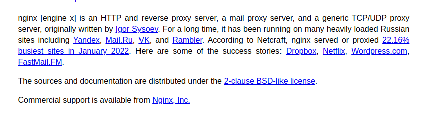
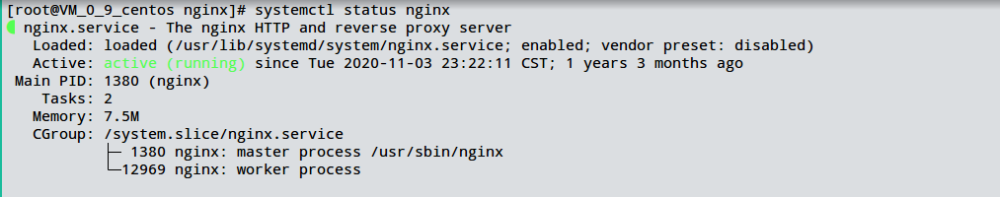
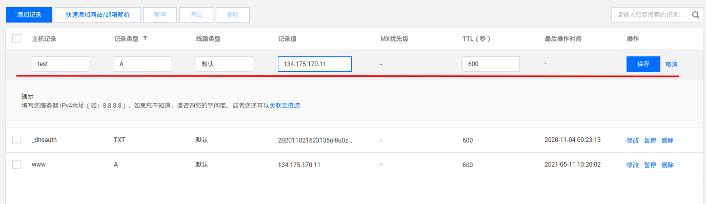
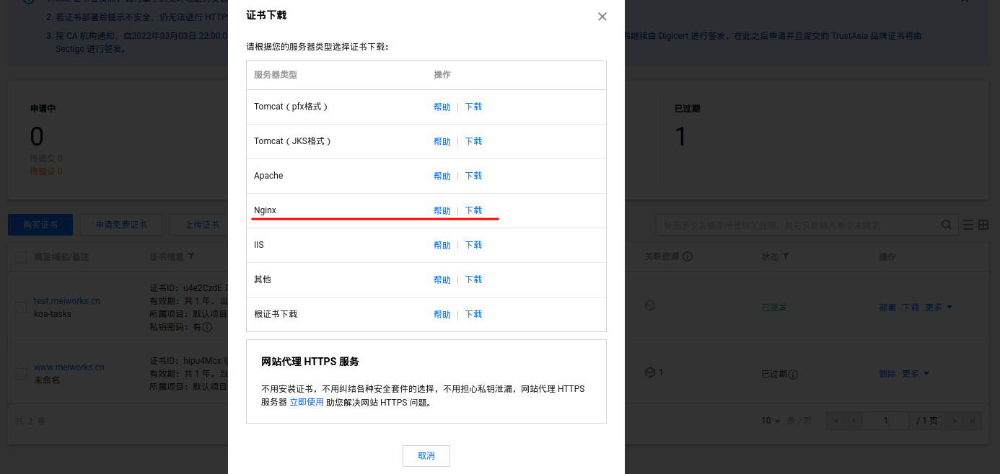
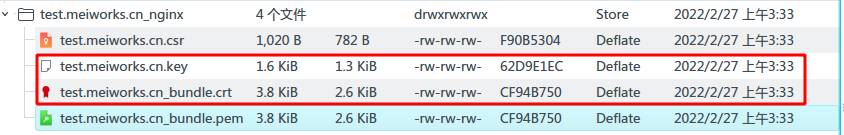

# 部署相关

## pm2管理工具  

koa是一个简单的web框架服务，没有日志记录，开机重启等功能。服务器部署的应用多了以后，也不方便监控各个服务的状态。所以需要其他的应用（进程）管理工具来搭配启动。  

pm2就是常用的一种进程管理工具，网上的介绍是pm2是一个守护进程管理器，它将帮助您全天候管理和保持应用程序在线。  

pm2官方文档地址： https://pm2.keymetrics.io/docs/usage/quick-start/

### 使用pm2
全局安装pm2工具
```bash
npm install pm2 -g
```

koa启动应用为node app.js,替换为pm2启动也很简单
```bash
pm2 start app.js
```
#### 配置项目
但是我们可能要很多参数要设置，不能只是简单启动应用，更优雅的方法是配置一下pm2文件，在根目录创建一个pm2.config.js文件。内容如下：  
```js
module.exports = {
    apps: {
        name: "koa_tasks",                     // 项目名              
        script: "app.js",                         // 执行文件    
        cwd: "./",                                // 根目录    
        args: "",                                 // 传递给脚本的参数    
        interpreter: "",                          // 指定的脚本解释器   
        interpreter_args: "",                     // 传递给解释器的参数    
        watch: false,                             // 是否监听文件变动然后重启    
        ignore_watch: [                           // 不用监听的文件      
            "node_modules",
            "logs"
        ],
        exec_mode: "cluster_mode",                // 应用启动模式，支持fork和cluster模式    
        instances: 4,                             // 应用启动实例个数，仅在cluster模式有效 默认为fork；或者 max    "max_memory_restart": '1G',                    // 最大内存限制数，超出自动重启    
        error_file: "./logs/app-err.log",         // 错误日志文件    
        out_file: "./logs/app-out.log",           // 正常日志文件    
        merge_logs: true,                         // 设置追加日志而不是新建日志    
        log_date_format: "YYYY-MM-DD HH:mm:ss",   // 指定日志文件的时间格式    
        min_uptime: "60s",                        // 应用运行少于时间被认为是异常启动    
        max_restarts: 30,                         // 最大异常重启次数，即小于min_uptime运行时间重启次数；    
        autorestart: true,                        // 默认为true, 发生异常的情况下自动重启    
        cron_restart: "",                         // crontab时间格式重启应用，目前只支持cluster模式;    
        restart_delay: 60,                     // 异常重启情况下，延时重启时间   
        prd: {
            NODE_ENV: "production"              // process.env.REMOTE_ADDR    
        },
        dev: {
            NODE_ENV: "development"
        },
        test: {
            // 环境参数，当前指定为测试环境 pm2 start app.js --test      
            NODE_ENV: "test"
        }
    }
};
```
具体其他的配置或者说明，可以查看官网文档  

#### 启动项目
然后我们可以通过pm2 start pm2.config.js启动项目，其他常用的语句有：  
```bash
pm2 start pm2.config.js #启动项目
pm2 stop id|name #可以通过id或者名称停止项目，id是启动后查看到的id，name是启动前配置的服务名称
pm2 restart id|name #重启应用
pm2 list #查看当前pm2管理的程序
pm2 logs id|name --lines 200 #查看应用的日志，要多更多的信息，可以使用--lines参数
pm2 delete id|name #销毁应用
```

我们通过修改package.json的script来更方便的启动和停止

然后我们就可以通过npm run start启动，npm run stop停止

### 设置开机自动重启pm2
开机自动重启pm2也很重要，机房断电后恢复供电重启服务器就可以自动重启应用了，不需要人为再操作  
```bash
pm2 startup
pm2 save
```
- 运行pm2 startup 在/etc/init.d/目录下生成pm2-root的启动脚本，且自动将pm2-root设为服务。

- 运行pm2 save 会将当前pm2所运行的应用保存在/root/.pm2/dump.pm2下，当开机重启时，运行pm2-root服务脚本，并且到/root/.pm2/dump.pm2下读取应用并启动。

## nginx
### nginx介绍
我们的后端应该启动以后通常会有一个启动端口，如7001,别人可以通过这个端口来访问我们的后端服务。  

但是前端打包好文件以后，别人如何访问这个静态文件呢，这就需要通过http服务应用“暴露”这些文件给别人访问。nginx就是这种http服务应用。  

**nginx常见的功能还有：**  
1.给后端应用负载均衡，比如我在A，B两台服务都启动了同一个服务应用，这样A挂了，B服务还能提供正常的访问服务。但是A和B启动的IP各不相同，前端应用访问的时候要有一个统一的访问地址。nginx的upstream功能就可以把不同IP和不同端口的应用统一起来，前端会先访问nginx给的统一的访问地址，nginx再把这个消息转发到对应的服务应用上。假如A的服务器性能是B的两倍，那nginx还能设置给A的请求多一点，B的请求少一点，帮助更好利用服务器性能。

2.管理http各种状态和策略，解决跨域问题，设置安全访问策略。比如限制那些IP能访问，那些IP不能访问，设置图片防盗链。限制访问频率，比如有人恶意爬取你网站内容，导致你的后端请求很频繁，你可以在nginx设置[漏桶算法](https://www.cnblogs.com/CarpenterLee/p/8084533.html)来限制别人的访问频率。

3.提供给静态资源http服务，让别人通过启用的端口（一般http为80,https为443）来访问你的前端资源

nginx的功能还有很多，官网的自我介绍如下：  


### 下载nginx
直接使用yum安装
```bash
yum install nginx
```
安装好以后，默认目录在/etc/nginx
```bash
[root@VM_0_9_centos ~] cd /etc/nginx/
[root@VM_0_9_centos nginx] ll
total 76
drwxr-xr-x 3 root root 4096 Sep 14 23:43 conf.d
drwxr-xr-x 2 root root 4096 Nov  1  2020 default.d
-rw-r--r-- 1 root root 1077 Nov  1  2020 fastcgi.conf
-rw-r--r-- 1 root root 1077 Nov  1  2020 fastcgi.conf.default
-rw-r--r-- 1 root root 1007 Nov  1  2020 fastcgi_params
-rw-r--r-- 1 root root 1007 Nov  1  2020 fastcgi_params.default
-rw-r--r-- 1 root root 2837 Nov  1  2020 koi-utf
-rw-r--r-- 1 root root 2223 Nov  1  2020 koi-win
-rw-r--r-- 1 root root 5231 Nov  1  2020 mime.types
-rw-r--r-- 1 root root 5231 Nov  1  2020 mime.types.default
-rw-r--r-- 1 root root 2454 Nov  4  2020 nginx.conf
-rw-r--r-- 1 root root 2656 Nov  1  2020 nginx.conf.default
-rw-r--r-- 1 root root  636 Nov  1  2020 scgi_params
-rw-r--r-- 1 root root  636 Nov  1  2020 scgi_params.default
-rw-r--r-- 1 root root  664 Nov  1  2020 uwsgi_params
-rw-r--r-- 1 root root  664 Nov  1  2020 uwsgi_params.default
-rw-r--r-- 1 root root 3610 Nov  1  2020 win-utf
```
我们可以通过`systemctl status nginx`来查看nginx是否启动  


systemctl是linux常用的服务管理工具，常用命令如下:  
```bash
#其他服务软件也可以通过systemctl进行管理，如mysql，redis等
systemctl start nginx #启动nginx服务
systemctl stop nginx  #停止nginx服务
systemctl enable nginx #设置nginx服务开机自启动
```

### 设置dns解析和域名证书  
首先，我们要在腾讯云dns解析服务上设置来访问我们这个应用服务，这里我们注册一个`test.meiworks.cn`的地址来访问服务应用  

这里的记录值是我们服务器的公网ip  


然后，我们在ssl证书服务中申请一个免费的证书

填写一下证书绑定的域名信息等  

填写自动绑定dns验证，之后几个步骤点确认就好了  


申请成功后，点击下载，选择Nginx证书   


解压文件夹，把.key和.crt的两个证书上传到远程服务器上  

这里我在远程服务器的/etc/nginx/conf.d/ssl目录下放置证书内容 
```bash
#这里用scp上传文件，mei为设置的远程ssh登录名称，ssh登录设置可以看环境和工具安装文档
scp test.meiworks.cn.key test.meiworks.cn_bundle.crt mei:/etc/nginx/conf.d/ssl
```

### 上传项目
在/root目录下创建一个work目录，并利用git工具，下载好后端和前端应用到work目录下
```bash
git clone ...koa-tasks.git #拉取项目
```

### 配置nginx
配置nginx，主要修改nginx安装目录下的`nginx.conf`,yum默认安装的目录在`/etc/nginx`下  
```nginx
# For more information on configuration, see:
#   * Official English Documentation: http://nginx.org/en/docs/
#   * Official Russian Documentation: http://nginx.org/ru/docs/

user root;
worker_processes auto;
error_log /var/log/nginx/error.log;
pid /run/nginx.pid;

# Load dynamic modules. See /usr/share/doc/nginx/README.dynamic.
include /usr/share/nginx/modules/*.conf;

events {
    worker_connections 1024;
}

http {
    log_format  main  '$remote_addr - $remote_user [$time_local] "$request" '
                      '$status $body_bytes_sent "$http_referer" '
                      '"$http_user_agent" "$http_x_forwarded_for"';

    access_log  /var/log/nginx/access.log  main;

    sendfile            on;
    tcp_nopush          on;
    tcp_nodelay         on;
    keepalive_timeout   65;
    types_hash_max_size 2048;

    include             /etc/nginx/mime.types;
    default_type        application/octet-stream;

    # Load modular configuration files from the /etc/nginx/conf.d directory.
    # See http://nginx.org/en/docs/ngx_core_module.html#include
    # for more information.
    include /etc/nginx/conf.d/*.conf;

    server {
        listen       80 default_server;
        listen       [::]:80 default_server;
        server_name  _;
        root         /usr/share/nginx/html;

        # Load configuration files for the default server block.
        include /etc/nginx/default.d/*.conf;

        location / {
        }

        error_page 404 /404.html;
        location = /404.html {
        }

        error_page 500 502 503 504 /50x.html;
        location = /50x.html {
        }
    }

# Settings for a TLS enabled server.
#
#    server {
#        listen       443 ssl http2 default_server;
#        listen       [::]:443 ssl http2 default_server;
#        server_name  _;
#        root         /usr/share/nginx/html;
#
#        ssl_certificate "/etc/pki/nginx/server.crt";
#        ssl_certificate_key "/etc/pki/nginx/private/server.key";
#        ssl_session_cache shared:SSL:1m;
#        ssl_session_timeout  10m;
#        ssl_ciphers HIGH:!aNULL:!MD5;
#        ssl_prefer_server_ciphers on;
#
#        # Load configuration files for the default server block.
#        include /etc/nginx/default.d/*.conf;
#
#        location / {
#        }
#
#        error_page 404 /404.html;
#        location = /404.html {
#        }
#
#        error_page 500 502 503 504 /50x.html;
#        location = /50x.html {
#        }
#    }

}

```
我们在`nginx.config`的配置中，在http模块里面，在server模块前面配置`include /etc/nginx/conf.d/*.conf;`这一句话，就是去找/etc/nginx/conf.d目录下其他所有后缀为*.conf的配置文件。  

加上这句话是因为可能以后我们会有很多应用的配置，这些配置都写在nginx.conf中会显得太长，可读性差。加上这句话，我们就可以把配置拆分开来，每个应用一个配置文件，保存在`conf.d`这个目录，只要是后缀名为.conf的我们就可以自动读取了  

在conf.d创建一个test.conf的配置文件
```bash
cd /etc/nginx/conf.d
vim test.conf
```
文件内容如下：
```nginx
server {
  listen 80; #监听80端口，http端口
  server_name test.meiworks.cn; #服务域名

  return 301 https://$server_name$request_uri; #请求这个端口时，强制跳转到https域名
}


server {
  listen 443 ssl; #监听443端口，https端口
  server_name test.meiworks.cn; #域名

  ssl_certificate /etc/nginx/conf.d/ssl/test.meiworks.cn_bundle.crt; #域名证书地址
  ssl_certificate_key /etc/nginx/conf.d/ssl/test.meiworks.cn.key;  #私钥
  proxy_set_header X-Forwarded-Ssl on;  #ssl模式为on
  proxy_set_header X-Forwarded-Proto https; #设置https协议

  #配置前端的静态文件
  #访问路径为/根目录时，读取/root/work/koa-tasks/dist目录下的静态资源
  #设置的入口文件为index.html或index.htm，访问/路径会读取入口文件
  #如访问test.meiworks.cn/b.html,会读取/root/work/koa-tasks/dist/b.html文件
  location / {  
    root /root/work/koa-tasks/dist;
    index index.html index.htm;
  }

  #设置后端地址，访问/api后缀的请求时统一访问本地7001端口的应用服务
  location /api {
    proxy_pass http://127.0.0.1:7001;
  }
}
```
配置完保存之后，我们通过以下命令验证和重新加载配置
```bash
#nginx -t命令检查配置语法没有写错
nginx -t
#输出：
#nginx: the configuration file /etc/nginx/nginx.conf syntax is ok
#nginx: configuration file /etc/nginx/nginx.conf test is successful

nginx -s reload #重新配置
```
重新配置后，我们就可以通过test.meiworks.cn来访问我们的服务了  

要深入了解nginx的配置和其他功能，可以通过nginx的其他书籍和文档深入学习  